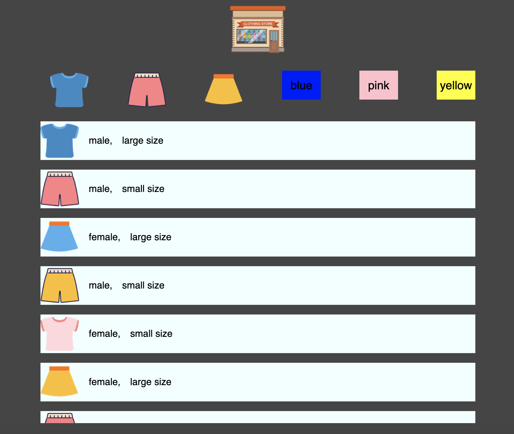

## 과제

- 아이템 스크롤링
- 데이터 자바스크립트에서 동적으로 받아오기
- 버튼을 이용한 간단한 필터링 기능

- 버튼에 호버 기능
- 상점 아이콘 클릭시 전 데이터 가져와서 보여주기

## 연습기간

5월 1일 ~ 5월 5일 시간날때 조금씩 해나감

## 걸린시간

8시간 정도 그이상일 수도...

## 결과물

## ref

- https://www.youtube.com/watch?v=We2Kv1HMGvc&list=PLv2d7VI9OotTVOL4QmPfvJWPJvkmv6h-2&index=7
- https://developer.mozilla.org

## 감상

처음으로 주어진 과제에 대해서 스스로 만들어봄  
지금까지 튜토리얼이나 다른 강의영상 따라 치는걸로 만족했었는데  
실제로 내가 지금 얼마나 아웃풋을 낼수 있나 어느정도 알수있었음  
정말 아직 너무 갈길이 멀다는것을 깨닳음  
css와 레이아웃을 아직도 개념이 부족함  
코드가 더럽든 중복되든 내가 만든 함수로 동적으로 데이터를 가져와서  
과제에 대한 답을 가시적으로 내놓았을때 기뻤음  
유투브 알고리즘에 의해 엘리님을 알게되서 이렇게 공부할수 있는 계기를 만들어 주신거에 대해 감사합니다.  
능력도 있으면서 배풀줄 아는 사람 굿굿!
